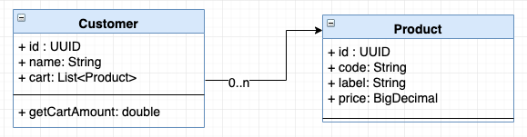

# Example of `hexagonal-architecture` implementation

Some references about hexagonal architecture:
- https://www.youtube.com/watch?v=th4AgBcrEHA (introduction by Alistair Cockburn)
- https://www.youtube.com/watch?v=Hi5aDfRe-aE
- https://en.wikipedia.org/wiki/Domain-driven_design
- https://blog.xebia.fr/2016/03/16/perennisez-votre-metier-avec-larchitecture-hexagonale/
- https://blog.octo.com/architecture-hexagonale-trois-principes-et-un-exemple-dimplementation/

This example application has been built with:
- JDK11
- Gradle 5.*
- Spring Boot 2

## Context

The application is a basic example which aims to handle customers and products so we can: 
- create products
- create customers 
- add products to customers' cart

Here is an UML class diagram of our model:


The domain also exposes some interfaces to interact with customers and products:

- `CustomerService.java`
```
public interface CustomerService {

  Customer signUp(String name);

  Option<Customer> findCustomer(String name);

  Customer addProductToCart(String name, String productCode);

  Customer emptyCart(String name);
}
```
- `ProductService.java`
```
public interface ProductService {

  Product createProduct(Product product);

  void deleteProduct(String code);
  
  List<Product> getAllProducts();

  Option<Product> findProductByCode(String code);
}
```

## Start-up

Run `docker-compose up -d`

#### Products

- Create a product: `curl --header "Content-Type: application/json" --request POST --data '{ "code": "1616", "label": "Easybreath", "price": 25.95 }' http://localhost:8080/products`
- List products: `curl --header "Content-Type: application/json" --request GET http://localhost:8080/products` 
- Find product: `curl --header "Content-Type: application/json" --request GET http://localhost:8080/products/1616` 

If you try to run the create product statement twice with the same product code, you will get an exception handled by domain:
```
{"timestamp":"2018-10-30T09:55:10.837+0000","status":500,"error":"Internal Server Error","message":"Product 1616 already exists so you can't create it","path":"/products"}
```

#### Customers

- Create a customer: `curl --header "Content-Type: application/json" --request POST --data 'rdelgatte' http://localhost:8080/customers`
- Find customer by login: `curl --header "Content-Type: application/json" --request GET http://localhost:8080/customers/rdelgatte` 
- Add product to customer's cart: `curl --header "Content-Type: application/json" --request PATCH --data '1616' http://localhost:8080/customers/rdelgatte` 

## Domain

`domain` is implemented as a standalone Java module which has no dependencies to any framework (neither spring).

Actually it has only two dependencies so we can use `Lombok` and `Vavr` as libraries to make data manipulation easier.

As defined in hexagonal architecture, in `domain` you will only find the data model definition and *API* + *SPI* interface definitions.
 
## Infrastructure

Here we will define the interactions over the domain so it implements these *ports* to implements the way to :
- interact with the domain (triggering actions)
- define where the domain gets its resources (persistence)

To do so, there are multiple sub-modules under infrastructure.

### API (Application Provider Interfaces)

It describes all the ports for everything that needs **to query the domain**. 

These interfaces are implemented by the domain.

#### Rest client

This module aims to expose some *rest* entry points to interact with products and customers.

### SPI

It gathers all the ports required by the domain **to retrieve information or get some services from third parties**. 

These interfaces are defined in the domain and implemented by the right side of the infrastructure.

#### In-memory persistence

Through this implementation, domain data can be persisted in memory by implementing SPI ports for domain `ProductRepository` and `CustomerRepository`.
Here is an example:

```
@Data
@AllArgsConstructor
@NoArgsConstructor
@Wither
public class InMemoryProductRepository implements ProductRepository {

  private List<Product> inMemoryProducts = List();

  public Product addProduct(Product product) {
    this.inMemoryProducts = getInMemoryProducts().append(product);
    return product;
  }

  public void deleteProduct(UUID productId) {
    this.inMemoryProducts = getInMemoryProducts().filter(product -> !product.getId().equals(productId));
  }

  public Option<Product> findProductByCode(String code) {
    return getInMemoryProducts().find(product -> product.getCode().equals(code));
  }

  public List<Product> findAllProducts() {
    return getInMemoryProducts();
  }
}
```

#### Postgres persistence

For Postgres database, add the following environment variables:

```
PG_PORT=5432
PG_DB_NAME=hexagonal-db
PG_USER_NAME=hexagonal
PG_PASSWORD=hexagonal
PG_HOST=localhost
```

## Application (module `application`)

This module contains the application which will instantiate any of the previously highlighted modules so it runs a stand-alone application with a specific configuration.

In `ApplicationConfiguration`, we can find the definition of both `ProductService` and `CustomerService` adapters from the domain where we can decide which repository we should use (in memory | postgres).

In the following example (default), we define the **persistence mode** for each service we want to use:
- `ProductService` will use `InMemoryProductRepository` (meaning products will be persisted in memory)
- `CustomerService` will use `InMemoryCustomerRepository` (meaning customers will be persisted in memory)

```
  private static final InMemoryProductRepository inMemoryProductRepository = new InMemoryProductRepository();

  private InMemoryCustomerRepository getCustomerRepository() {
    return new InMemoryCustomerRepository();
  }

  @Bean
  CustomerService customerService() {
    return new CustomerServiceImpl(getCustomerRepository(), inMemoryProductRepository);
  }

  @Bean
  ProductService productService() {
    return new ProductServiceImpl(inMemoryProductRepository);
  }
```

If we want to use postgres-persistence for products, we need to change configuration to:
```
  PostgresProductRepository postgresProductRepository(
      PostgresSpringDataProductRepository postgresSpringDataProductRepository) {
    return new PostgresProductRepository(postgresSpringDataProductRepository);
  }

  private InMemoryCustomerRepository getCustomerRepository() {
    return new InMemoryCustomerRepository();
  }

  @Bean
  CustomerService customerService(PostgresSpringDataProductRepository postgresSpringDataProductRepository) {
    return new CustomerServiceImpl(getCustomerRepository(),
        postgresProductRepository(postgresSpringDataProductRepository));
  }

  @Bean
  ProductService productService(PostgresSpringDataProductRepository postgresSpringDataProductRepository) {
    return new ProductServiceImpl(postgresProductRepository(postgresSpringDataProductRepository));
  }
```

Note: if we want to use outside package beans, we need to explicit the package to configuration as below:
```
@ComponentScan(basePackages = {
    "com.rdelgatte.hexagonal.persistence.postgres",
})
``` 

## Demo

[See demo scenario](doc/demo.md)