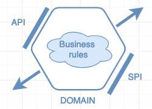
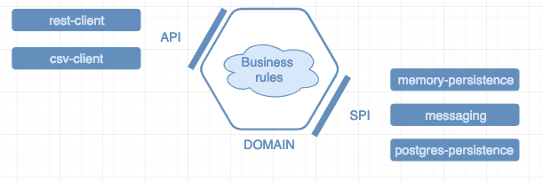

# Demo

## Step 1 - Domain

It is a simple module which is composed of:
- `domain`: Domain POJOs
- `api`: Application Provider Interface - Interfaces which expose services to interact with the domain (customer sign-up, adding product to customer's cart, create product...)
- `spi`: Service Provider Interface - Interfaces which expose services that are required by the domain to manage data (eg. persistence)


**NOTHING** should enter domain! It has no dependency to implementation frameworks (spring / jpa / ...).  



Examples of modules to interact with the domain: 


## Step 2 - Memory-persistence module

Module to implement the interfaces exposed by the domain (as SPI) so we store the `products` and `customers` in memory.
To do so, we need to implement both repositories as below:

``` 
public class InMemoryProductRepository implements ProductRepository {

  private List<Product> inMemoryProducts = API.List();

  public Product addProduct(Product product) {
    this.inMemoryProducts = getInMemoryProducts().append(product);
    return product;
  }

  public void deleteProduct(UUID productId) {
    this.inMemoryProducts = getInMemoryProducts().filter(product -> !product.getId().equals(productId));
  }

  public Option<Product> findProductByCode(String code) {
    return getInMemoryProducts().find(product -> product.getCode().equals(code));
  }

  public List<Product> findAllProducts() {
    return getInMemoryProducts();
  }
}
```

## Step 3 - First application to use services 

Console application which uses dependencies to domain and this in-memory persistence module: 
- Quickly test business logic in an application 
- Fast feedback 

## Step 4 - Changing business logic

Ok we can now create product and customers but we can create product without price :-(

Let's add a new rule: **Prevent product to be created without price | with price <= 0**

## Step 5 - Rest client 

Module to implement a spring boot rest client module to expose some endpoints using the domain services. 

It only contains: 
- `CustomerController.java`: controller to handle actions to do about customers (create / add product to cart / find)
- `ProductControler.java`: controller to handle actions to do about products (create / update / find)

---
**Note:** 
- *It is not necessary to implement all services exposed by the domain.*
- *We can also transform the exposed items using DTO*
---

## Step 6 - Postgres 

Module to implement the persistence system using Postgres as for `memory-persistence`:
```
@Repository
@AllArgsConstructor
public class PostgresProductRepository implements ProductRepository {

  private PostgresSpringDataProductRepository postgresSpringDataProductRepository;

  @Override
  public Product addProduct(Product product) {
    return postgresSpringDataProductRepository.save(PostgresProduct.fromProduct(product))
        .toProduct();
  }

  @Override
  public void deleteProduct(UUID productId) {
    postgresSpringDataProductRepository.deleteById(productId);
  }

  @Override
  public Option<Product> findProductByCode(String code) {
    return ofOptional(postgresSpringDataProductRepository.findByCode(code).map(PostgresProduct::toProduct));
  }

  @Override
  public List<Product> findAllProducts() {
    return ofAll(postgresSpringDataProductRepository.findAll())
        .map(PostgresProduct::toProduct);
  }
}
```

Here we need to handle DAO so objects stored in Postgres are defined as below:

```
@Entity
@Data
@AllArgsConstructor
@NoArgsConstructor
@Wither
public class PostgresProduct {

  @Id
  private UUID id = randomUUID();
  private String code = "";
  private String label = "";
  private BigDecimal price = ZERO;  
}
```

## Step 7 - Web application

Spring boot application which uses dependencies to the `domain` but also `postgres-persistence`, `memory-persistence` and `rest-client` so we can interact with the domain using `curl` commands and store data in-memory.

- Create a product: `curl --header "Content-Type: application/json" --request POST --data '{ "code": "1616", "label": "Easybreath", "price": 25.95 }' http://localhost:8080/products`
- List products: `curl --header "Content-Type: application/json" --request GET http://localhost:8080/products` 
- Find product: `curl --header "Content-Type: application/json" --request GET http://localhost:8080/products/1616` 
- Create a customer: `curl --header "Content-Type: application/json" --request POST --data 'rdelgatte' http://localhost:8080/customers`
- Find customer by login: `curl --header "Content-Type: application/json" --request GET http://localhost:8080/customers/rdelgatte` 
- Add product to customer's cart: `curl --header "Content-Type: application/json" --request PATCH --data '1616' http://localhost:8080/customers/rdelgatte` 

### Configuration / Dependencies
We need to explicitly define the `ProductService` and `CustomerService` so we provide the persistence module to use for each.
